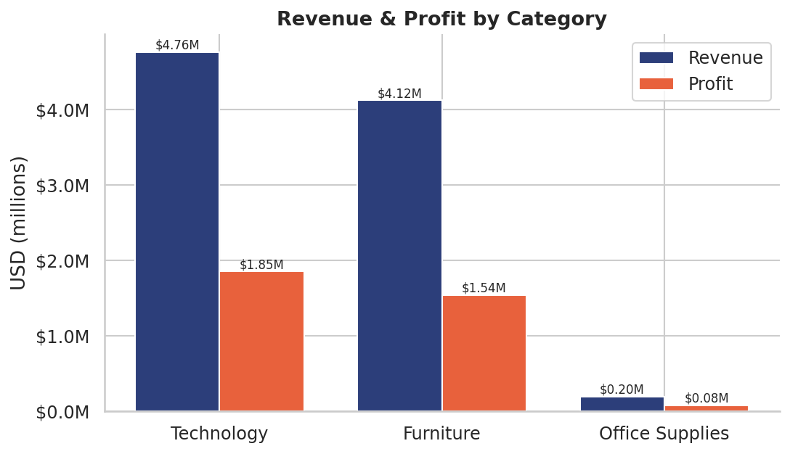
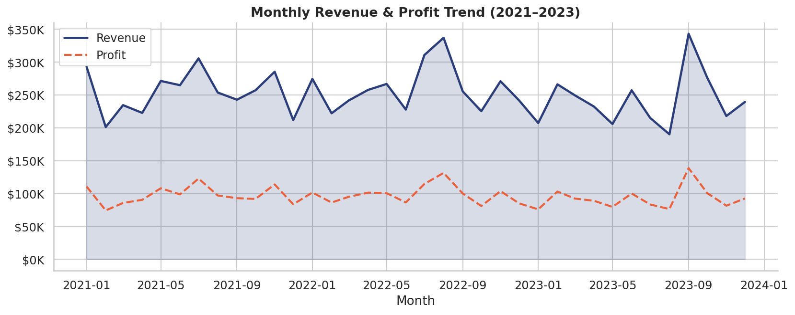
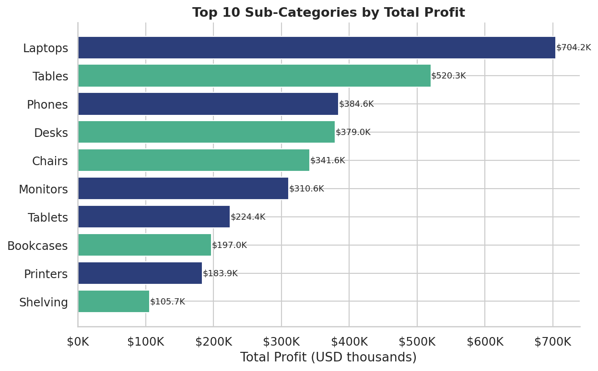
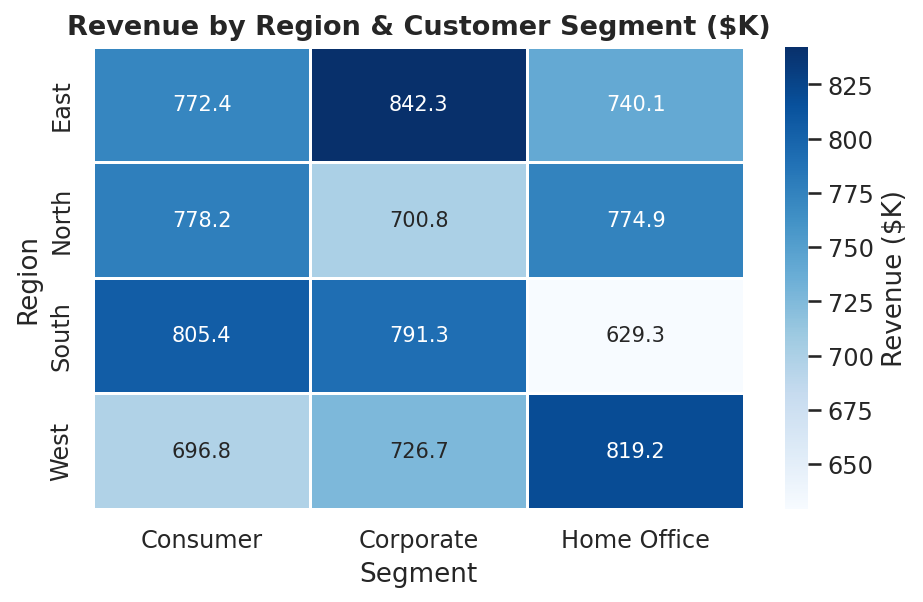
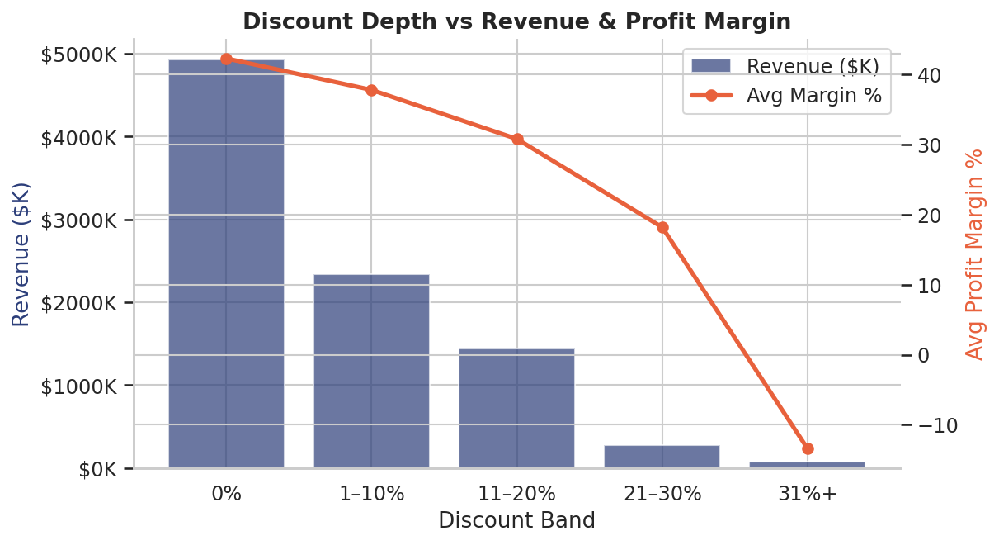
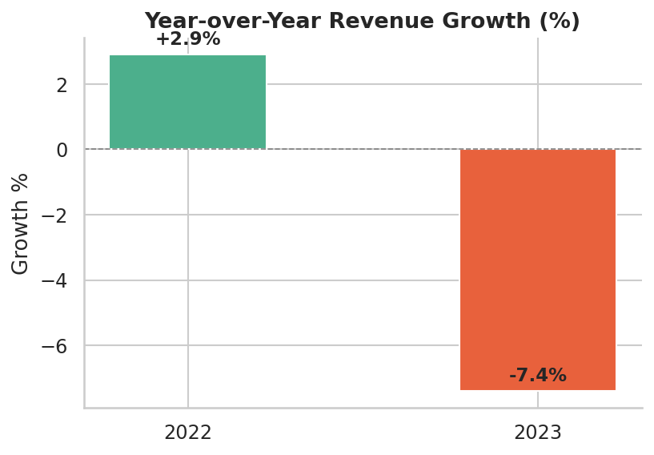

# 🛒 Retail Sales Analysis (2021–2023)

A full end-to-end data analysis project simulating the workflow of a junior analyst at a retail company, from raw messy data through cleaning, SQL querying, and visual storytelling.

---

## 📌 Questions Answered Through The Data

| # | Question |
|---|----------|
| 1 | Which product category drives the most revenue and profit? |
| 2 | How does revenue trend month-to-month across three years? |
| 3 | Which sub-categories are most and least profitable? |
| 4 | Which region + customer segment combinations are highest-value? |
| 5 | Are heavy discounts destroying profit margin? |
| 6 | Does shipping mode affect profitability or speed? |
| 7 | Is the business growing year-over-year? |

---

## 🗂️ Project Structure

```
retail-sales-analysis/
│
├── data/
│   ├── generate_data.py        # Generates the raw synthetic dataset
│   ├── raw_sales_data.csv      # Raw data (intentionally messy)
│   ├── clean_sales_data.csv    # Cleaned output
│   └── sales.db                # SQLite database
│
├── notebooks/
│   └── analysis.py             # Main analysis script (cleaning → SQL → charts)
│
├── sql/
│   └── queries.sql             # All 7 SQL queries, standalone & commented
│
├── outputs/                    # All generated charts (PNG)
│   ├── fig1_category_revenue_profit.png
│   ├── fig2_monthly_trend.png
│   ├── fig3_top_subcategories.png
│   ├── fig4_region_segment_heatmap.png
│   ├── fig5_discount_impact.png
│   └── fig6_yoy_growth.png
│
├── requirements.txt
└── README.md
```

---

## 🔧 Tech Stack

- **Python 3.11+** — pandas, numpy, matplotlib, seaborn
- **SQL (SQLite)** — 7 analytical queries covering aggregations, CASE statements, CTEs, and window functions
- **Data generation** — Faker library for realistic synthetic data

---

## 🧹 Cleaning Steps

The raw dataset contained several realistic data quality issues, all resolved before analysis:

| Issue | Count | Fix Applied |
|-------|-------|-------------|
| Missing `ship_mode` | 152 rows (3%) | Imputed with column mode |
| Missing `revenue` | 46 rows (1%) | Recalculated from `unit_price × quantity × (1 - discount)` |
| Negative `quantity` | 67 rows | Dropped (assumed data-entry errors) |
| Duplicate `order_id` | 5 rows | Flagged in audit |

Post-cleaning: **4,933 rows, 0 null values**

---

## 📊 Key Findings

### 1. Technology & Furniture lead in revenue but Office Supplies are volume-driven
Technology and Furniture account for over 97% of total revenue (~$4.8M and ~$4.1M respectively), while Office Supplies, show higher order volume and contribute only ~$197K due to lower unit prices.

### 2. Discounts above 20% are margin-killers
Orders with 0% discount average a **42.3% profit margin**. Orders discounted 31%+ averaged a **-13.4% margin**, actively losing money. This is the single most significant insight in the dataset has offered.

### 3. Revenue dipped in 2023
After a 2.9% year-over-year increase in 2022, revenue declined 7.4% in 2023. The decline is concentrated in H1 2023, while Sep 2023 was the single highest-revenue month in the entire dataset ($343K).

### 4. Laptops alone drove $704K in profit
The top 3 sub-categories by profit - Laptops ($704K), Tables ($520K), and Phones ($385K) - account for over 35% of all profit.

### 5. Regional performance is relatively balanced
No single region dominates. The east leads slightly, but all four regions fall within $150K of each other in total revenue, suggesting consistent national reach.

---

## 📈 Charts

### Revenue & Profit by Category


### Monthly Revenue & Profit Trend


### Top 10 Sub-Categories by Profit


### Revenue by Region & Segment


### Discount Depth vs Profit Margin


### Year-over-Year Growth


---

## ▶️ How to Run

```bash
# 1. Clone and install dependencies
git clone https://github.com/vinethsam/retail-sales-analysis.git
cd retail-sales-analysis
pip install -r requirements.txt

# 2. Generate the raw dataset
python data/generate_data.py

# 3. Run the full analysis (cleaning + SQL + charts)
python notebooks/analysis.py

# 4. Explore the SQL queries standalone
# Open sql/queries.sql in any SQLite-compatible tool (DB Browser, DBeaver, etc.)
```
---

## 📄 Dataset

Synthetic data generated with Python's `Faker` library to simulate a realistic retail order history. No real customer data was used.
